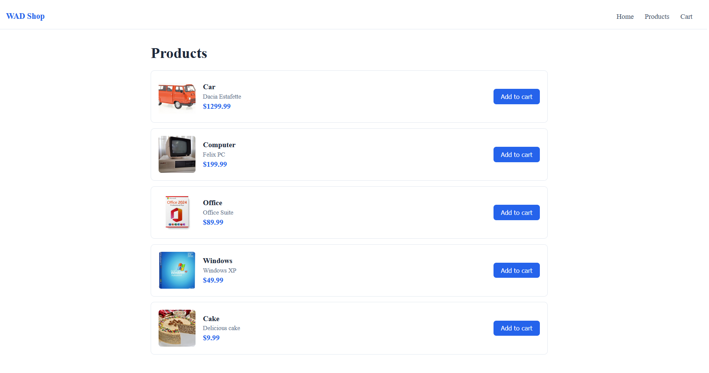
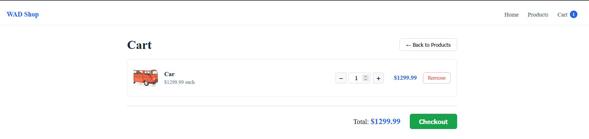

WP2/IPT Lab4

Backend-SpringBoot http://localhost:8080
Frontend-React http://localhost:3000
You need NodeJS installed in order to work with React. (https://www.nvmnode.com/ NVM extra in order to handle multiple versions of NodeJS easily.)

They communicate using REST API. The backend serves product data as JSON. 
    GET /api/products — returns a list of all products as JSON
    GET /api/cart/add?pid={id} — returns a single product by its id

Frontend structure:
src/
  components/
    Navbar/
      index.js
      Navbar.jsx                  navigation bar with cart item count
      Navbar.module.css
    Product/
      index.js
      Product.jsx                 renders a single product row
      Product.module.css
    CartItem/
      index.js
      CartItem.jsx                renders a single cart item row
      CartItem.module.css
  pages/
    HomePage/
      index.js
      HomePage.jsx                landing page
      HomePage.module.css
    ProductList/
      index.js
      ProductList.jsx             fetches products from the backend, lists them
      ProductList.module.css
    CartPage/
      index.js
      CartPage.jsx                displays the cart contents
      CartPage.module.css
  services/
    product.service.js            API call to fetch all products
    cart.service.js               API call to add a product to cart
  App.jsx                         holds cart state, wires everything together
  App.css                         global shared styles
  
Running the app:
First, run the backend.
Then, run the frontend using the command "npm install && npm start". 

Lab Activity
1. Implement an Add to cart button that should be displayed for each product. (start at: App.jsx)
2. Render the list of cart items in CartPage. (start at: CartPage.jsx)
3. Display all cart items details in Cart page. (start at: CartItem.jsx)
4. Add a Remove from cart button. (start at: App.jsx)
5. From the cart page add a checkout button. When it is pressed the contents of the cart is removed. (start at: App.jsx)
6. In the cart page add a quantity input for each product in the cart. Display the total amount of the order. start at: App.jsx)
7. Implement a notification that lasts for a few seconds in the Products page, whenever the user presses the AddToCart button. The notification should display "Name_of_the_product was added to cart!". (Start at: ProductList.jsx)

 
